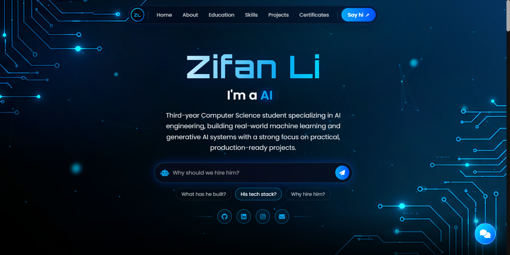

# Zifan's Portfolio Website

A personal portfolio website featuring an AI-powered chatbot built with Retrieval-Augmented Generation (RAG). The chatbot uses semantic search over personal documents to answer questions about my background, skills, and projects — reachable both from a floating widget and a live "ask" bar in the hero.

**Live Site:** [zifan-portfolio.vercel.app](https://zifan-portfolio.vercel.app)



## Features

### Portfolio
- **Living Neural Background** — Custom `<canvas>` animation of nodes and synapses with traveling "thought" pulses; reacts to the cursor and fires cascades on click (replaces particles.js)
- **Interactive Hero** — Floating neuron orbs with depth parallax, a typewriter role cycler, and a live Exilus ask-bar that sends questions straight to the RAG backend from the landing screen
- **Responsive Design** — Fully optimized for desktop, tablet, and mobile devices
- **Interactive Sections** — Home, About, Education, Skills, Projects, Certificates, Contact
- **Project Carousel** — 3D coverflow effect using Swiper.js
- **PDF Certificates** — Rendered directly in-browser with PDF.js
- **Contact Form** — Integrated with Formspree, submitted over AJAX with inline status feedback

### AI Chatbot (Exilus)
- **RAG-Powered** — Retrieves relevant context from personal documents before generating responses
- **Semantic Search** — Uses ChromaDB vector database for intelligent document retrieval
- **Rate Limited** — 10 requests per minute to prevent abuse
- **Input Validation** — 500 character limit with sanitization
- **Powered by GPT-4o-mini** — Fast, cost-effective responses

## Deployment

| Component | Platform | URL |
|-----------|----------|-----|
| Frontend | [Vercel](https://vercel.com/) | `zifan-portfolio.vercel.app` |
| Backend API | [Render](https://render.com/) | `portfolio-chatbot-od42.onrender.com` |
| Contact Form | [Formspree](https://formspree.io/) | `formspree.io/f/mldlgqrd` |

## Project Structure

```
Portfolio Website/
├── index.html              # Single-page HTML (all sections)
├── RESUME.tex              # LaTeX resume source
├── README.md
│
├── css/
│   ├── style.css           # Main styles
│   └── chatbot.css         # Chatbot component styles
│
├── js/
│   ├── neural.js           # Neural-canvas background + pulses
│   └── chatbot.js          # Chatbot frontend logic
│
├── images/
│   ├── backgrounds/        # Background images
│   ├── certificates/       # Certificate images
│   ├── education/          # School/university logos
│   ├── icons/              # Skill & tech icons (SVG)
│   ├── profile/            # Profile photos
│   ├── projects/           # Project screenshots
│   ├── robot/              # Chatbot avatar
│   └── others/             # Resume PDF for download
│
├── documents/              # PDF certificates
├── videos/                 # Demo/background video assets
│
└── backend/
    ├── main.py             # FastAPI server
    ├── rag.py              # RAG retrieval logic
    ├── ingest.py           # Document ingestion script
    ├── requirements.txt    # Python dependencies
    ├── chroma_db/          # Vector database (generated)
    └── data/               # Source documents for RAG
        ├── profile_summary.md
        ├── educaton.md
        ├── skills.md
        ├── work_experience.md
        ├── career_goals.md
        ├── current_focus.md
        ├── technical_focus.md
        ├── hobbies.md
        └── heart_disease_predictor.md
```

## Tech Stack

### Frontend
| Technology | Purpose |
|------------|---------|
| HTML5 / CSS3 / JavaScript | Core web technologies |
| Custom Canvas (`js/neural.js`) | Animated neural background, no library |
| [Swiper.js](https://swiperjs.com/) | Project carousel with 3D coverflow |
| [AOS](https://michalsnik.github.io/aos/) | Scroll animations |
| [Typed.js](https://mattboldt.com/demos/typed-js/) | Typewriter text effect |
| [PDF.js](https://mozilla.github.io/pdf.js/) | In-browser PDF rendering |
| [Font Awesome](https://fontawesome.com/) | Icons |
| [Formspree](https://formspree.io/) | Contact form backend |

### Backend
| Technology | Purpose |
|------------|---------|
| [Python 3.13+](https://www.python.org/) | Runtime |
| [FastAPI](https://fastapi.tiangolo.com/) | Web framework |
| [LangChain](https://www.langchain.com/) | RAG orchestration |
| [OpenAI API](https://openai.com/) | GPT-4o-mini for response generation |
| [ChromaDB](https://www.trychroma.com/) | Vector database for semantic search |
| [SlowAPI](https://github.com/laurentS/slowapi) | Rate limiting |
